# BME688 Sensor Evaluation Project

## 1. Introduction

The Bosch BME688 is a 4-in-1 environmental sensor that combines a metal-oxide (MOX) gas sensor with integrated temperature, humidity and barometric pressure measurement. In this project the BME688 is used as an “electronic nose” to study how its gas-sensing output behaves under controlled exposure to ethanol and water vapour. The sensor is mounted on a DFRobot Gravity: BME688 AI Environmental Sensor board, which includes level shifting and a simple I²C interface.

In this project, the selected sensor is characterised in terms of sensitivity, linearity, repeatability, and reproducibility. For the BME688, this means analysing how changes in vapour concentration affect the measured gas resistance, and evaluating how stable and repeatable these measurements are under controlled conditions.

## 2. Objective

The goal of this project is to study the performance of the Bosch BME688 Environmental Sensor connected to an ESP32-C6 development board. The main focus is on determining:

- **Sensitivity** — how much the gas-sensor resistance changes per step in input quantity (ethanol/water vapour level).
- **Linearity** — how well the sensor response follows a proportional trend over several vapour levels.
- **Repeatability** — how closely repeated measurements agree when the setup and conditions are kept the same.
- **Reproducibility** — how stable the results are when measurements are repeated under different ambient temperatures.

The outcome is a technical report in Markdown that documents the hardware setup, firmware, measurement stand, data logging, analysis workflow, and the final sensitivity, linearity, repeatability and reproducibility estimates.

## 3. Hardware and Software Setup

### 3.1 Sensor and Microcontroller Platform

For this project, the **Gravity: BME688 AI Environmental Sensor (DFRobot SEN0617)** was selected.  
It is a breakout board based on the Bosch BME688 MEMS gas sensor and provides:

- metal-oxide (MOX) gas sensing  
- temperature, humidity and barometric pressure measurements  
- I²C/SPI communication  
- integrated level shifting (supports **3.3–5.0 V** input)

**Key specifications (from DFRobot):**
- Operating voltage: **3.3–5.0 V**  
- Communication: **I²C / SPI**  
- Temperature accuracy: **±0.5 °C**  
- Humidity accuracy: **±3 % RH**  
- Pressure accuracy: **±0.6 hPa**  
- Board size: **30 × 22 mm**

The microcontroller used is an **ESP32-C6 development board**, programmed via the ESP-IDF toolchain.  
It provides full I²C support and is powered over USB-C.

---

### 3.2 Electrical Connections (I²C)

The Gravity sensor uses a 4-pin JST-PH cable (+, –, C, D).  
Connections to the ESP32-C6 are:

- **VCC** → 5 V  
- **GND** → GND  
- **SCL (C)** → GPIO 3  
- **SDA (D)** → GPIO 2  

The module defaults to I²C address **0x77**.  
Internal ESP32 pull-ups were used; no external components were required.

---

### 3.3 Firmware and Bosch Driver Integration

The firmware is implemented as an ESP-IDF C project in `firmware/`.  
The official Bosch **BME68x driver** (`bme68x.c/.h/.defs.h`) was added as a standalone component.

To interface the driver with ESP-IDF’s modern I²C API, three wrapper functions were written:

- `bme_user_read()` — register read via `i2c_master_transmit_receive()`  
- `bme_user_write()` — register write via `i2c_master_transmit()`  
- `bme_user_delay_us()` — timing using `esp_rom_delay_us()` or `vTaskDelay()`

After creating the I²C bus and device handle, the firmware:

1. Reads the **CHIP_ID** register (`0xD0`) to confirm communication (`0x61` expected)  
2. Calls `bme68x_init()`  
3. Configures sensor oversampling:  
   - Temperature ×8  
   - Pressure ×4  
   - Humidity ×2  
4. Enables the MOX heater in **forced-mode**:  
   - **320 °C heater temperature**
   - **150 ms heater duration**

The main loop triggers a measurement, waits for the required duration, reads data via `bme68x_get_data()`, and prints it as CSV.

---

### 3.4 Data logging Script (`./log.sh`)

All sensor data is printed as semicolon-separated CSV lines:

```text
timestamp_ms;temperature_C;humidity_pct;pressure_hPa;gas_ohm
12345;24.312;50.78;1009.39;99786
```
To automate data capture, a Bash script `log.sh` was created. It:

- launches `idf.py monitor`  
- strips ANSI colour codes from serial output  
- filters only valid CSV lines  
- creates the `logs/` directory and  
- saves data as timestamped CSV files, e.g.:

```text
logs/20251201_1634_baseline.csv
```

Each logging session produces a self-contained CSV file suitable for analysis in Excel or any plotting tool.

---

### 3.5 Project Structure

The project folder is organised into separate subfolders for the firmware, measurement files, analysis scripts and plots.

```
bme688-project/
├── analysis/          # Python scripts for data processing and plotting
├── figures/           # Project images
├── firmware/          # ESP32-C6 firmware (ESP-IDF project)
├── models/            # 3D models of the measurement chamber
├── plots/             # Plots generated by analysis scripts
├── logs/              # Raw CSV logs (not tracked)
├── README.md          # Project report
└── stats_summary.csv  # Collected statistics (mean, std) for each measurement
```

## 4. Measurement Setup

### 4.1 Custom 3D-Printed Measurement Chamber

To perform controlled vapour measurements, a custom measurement chamber was designed in Autodesk Fusion 360 and 3D-printed.

The final chamber dimensions are:

- **Width:** 8 cm  
- **Length:** 8 cm  
- **Height:** 5 cm  

This corresponds to a volume of approximately **320 ml**, which is small enough for fast sensor response but large enough to avoid immediate sensor saturation.

The chamber includes:

- a removable lid with a mounting slot for the BME688 sensor,
- a fixed **40–45 mm distance** between the sensor and the cotton pad,
- a single cable inlet for slow air exchange,
- a flat bottom for placing the vapour source.

Figures of the design and slicing preview are shown below:

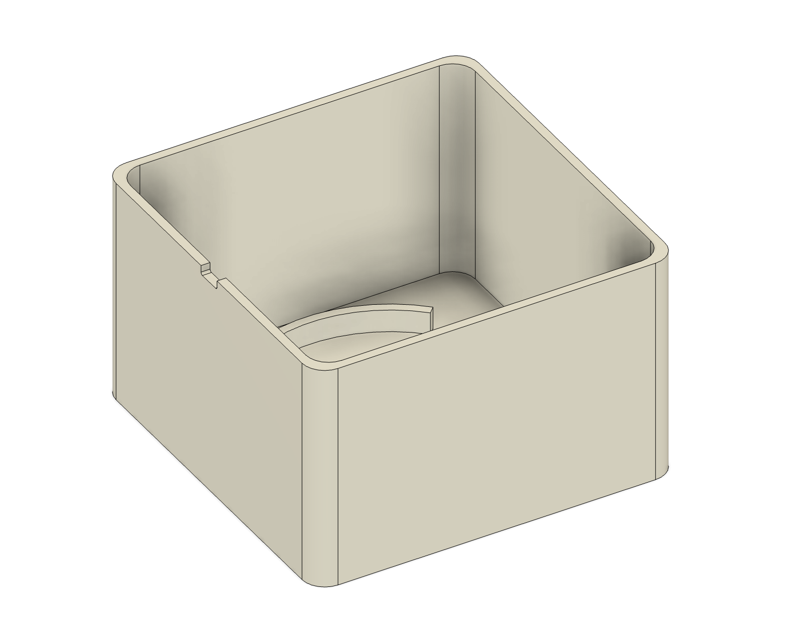  
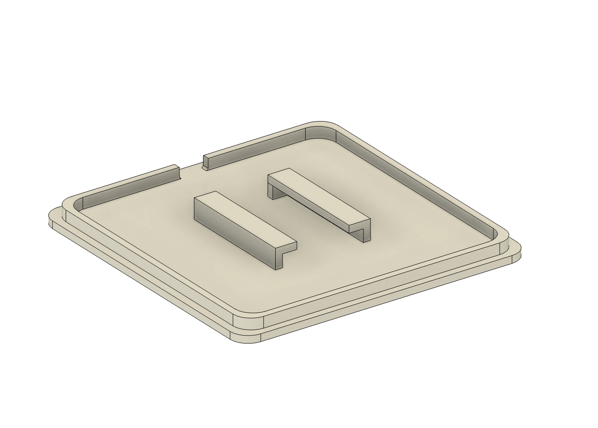  


---

### 4.2 Chamber Dimensions

The chamber size was chosen so that the sensor reacts fast, but does not reach saturation instantly.  
The fixed 40–45 mm distance between the sensor and the vapour source keeps measurement conditions similar in all tests.  
Slow air exchange through the cable opening helps the vapour concentration stabilise during each measurement.

---

### 4.3 Sensor and Vapour Source Placement

The BME688 sensor is mounted upside down on the inner side of the lid so that the vapour rises naturally toward the sensing element and the sensor–source distance remains constant.

A **55 × 55 mm cotton pad** is placed at the centre of the chamber bottom.  
One drop of ethanol solution or water is applied for each test level.  
Between measurements, the pad is replaced or the chamber is ventilated to restore baseline conditions.

---

### 4.4 External mounting and cable management

The BME688 module is supplied with a Gravity I²C cable (JST-PH to female Dupont).  
Because both the breadboard and the ESP32-C6 board use female headers, the cable could not be connected directly.  
To resolve this, male-to-male jumper adapters were added so that the Gravity cable can be plugged cleanly into the breadboard and routed to the ESP32-C6.

A compact 170-pin breadboard was attached to the outside of the chamber lid, allowing the ESP32-C6 to be fixed in place and preventing accidental wire movement during measurements.

## 5. Measurement Procedure

### 5.1 General measurement algorithm

All measurements (baseline and ethanol tests) follow the same general procedure.

1. The BME688 sensor and the cotton pad are installed in the 3D-printed chamber (sensor in the lid, dry pad at the bottom, fixed **40–45 mm** distance).
2. The ESP32-C6 board is connected to the laptop over USB-C, and the firmware is flashed using `idf.py build flash`.
3. The logging script `log.sh` is started in the `firmware/` directory using `./log.sh`.
4. The measurement label (baseline, sensitivity level, repeatability or reproducibility test) is entered when prompted by the script.
5. The system is left untouched until the gas sensor readings reach a stable level.
6. For ethanol measurements, one drop of the prepared ethanol–water solution is applied to the cotton pad and the chamber is closed immediately.
7. The sensor response is recorded continuously for several minutes.
8. After each measurement, the chamber is opened and ventilated until the gas resistance stabilises again.
9. The resulting CSV log file is automatically saved with a timestamped filename in the logs/ directory.
10. The recorded data is later processed using the Python analysis script.

All measurements were performed using a fixed gas-sensor heater configuration of **320 °C and 150 ms** in **forced mode**.

---

### Data analysis script (`analysis/analyze.py`)

For all measurements, the raw CSV logs are processed with a Python script located in `analysis/analyze.py`. 

```bash
python analysis/analyze.py logs/20251201_1634_baseline.csv
```

The script performs the following steps:

- reads the semicolon-separated CSV log files,
- converts the time axis from milliseconds to seconds,
- converts gas resistance from ohms to kilo-ohms for easier interpretation,
- automatically extracts only the stable tail of the measurement for all tests,
- computes statistical parameters (mean and standard deviation),
- generates time-series plots of gas resistance, temperature and humidity
- saves all generated plots into the `plots/` directory.

These statistics and plots are later used to estimate the sensor’s sensitivity, linearity, repeatability and reproducibility.

For each measurement file, basic statistical parameters (mean, standard deviation) were automatically computed and stored in a separate summary file (`stats_summary.csv`) for further sensitivity, linearity, repeatability and reproducibility analysis.

---

### 5.2 Baseline measurement in clean air

Before ethanol measurements, a baseline measurement was performed in clean air to characterise the initial behaviour of the BME688 gas sensor.

The general procedure described in Section 5.1 was followed.
The cotton pad was completely dry and no vapour source was present inside the chamber.
The sensor was left running for about 10–15 minutes to allow the internal heater and gas signal to stabilise.

The recorded CSV file contains the time series of:
- gas resistance
- temperature
- relative humidity
- pressure

A short preview of the recorded baseline data is shown below:


The baseline measurement was performed under stable indoor conditions.
Ambient temperature, humidity and pressure were monitored directly using the BME688 sensor.

---

### Baseline gas resistance over time

The figure below shows the baseline gas sensor resistance measured in clean air as a function of time.

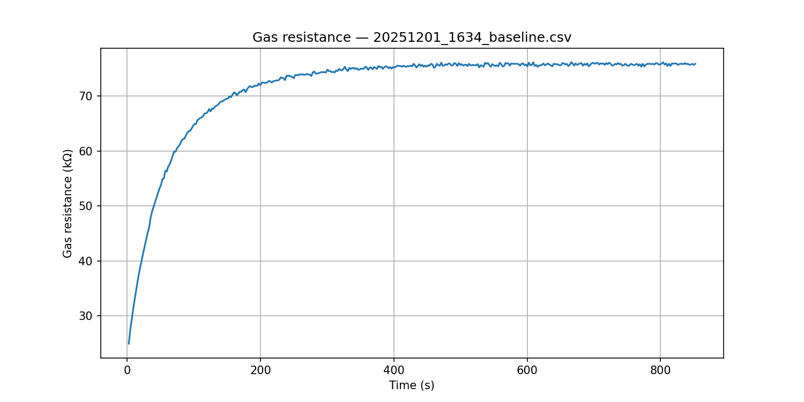

At the beginning of the measurement, the gas resistance changes due to sensor warm-up and heater stabilisation.
After this initial phase, the signal reaches a **stable plateau**, which represents the steady-state baseline level.  

---

### Baseline time constant (τ)

The baseline measurement was also used to estimate the **time constant τ** of the gas sensor.
The dynamic response of the sensor can be approximated by a first-order model:

R(t) = R₀ + ΔR · (1 − e^(−t/τ))

where:
- R₀ is the initial gas resistance,
- ΔR = R∞ − R₀ is the total change,
- R∞ is the final steady-state value,
- τ is the time constant of the sensor.

The time constant τ is defined as the time required for the signal to reach 63.2% of the total change from R₀ to R∞.

The estimated value of τ was obtained automatically using the script `baseline_tau.py`.
The resulting plot with the marked τ point and the corresponding steady-state levels is shown below:

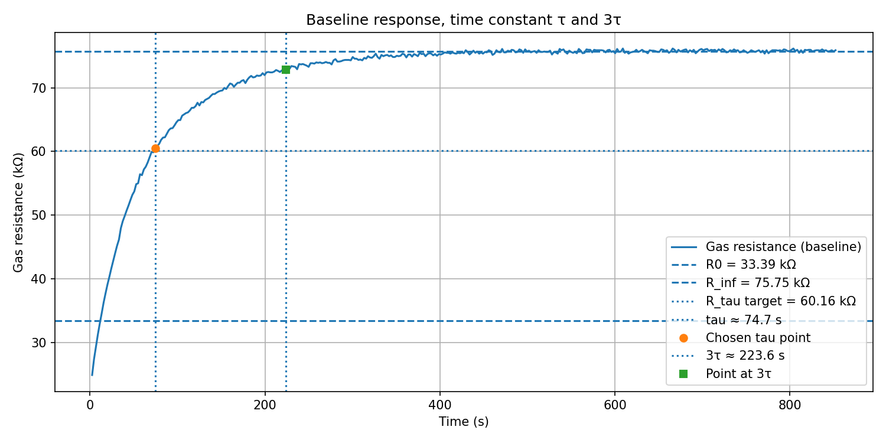

In addition to the time constant itself, the `baseline_tau.py` script also checks the sensor state at 3τ.
For this dataset, 3τ ≈ 224 s.
At this time, the measured resistance reaches approximately 93.2% of the total change from R₀ to R∞, which is close to the ideal first-order value of 95%.

This result confirms that the BME688 gas sensor requires **several minutes** to reach thermal and chemical equilibrium in clean air.
Therefore, in all further experiments (**sensitivity, repeatability and reproducibility**), only the **steady-state tail part** of each measurement was used for calculating the mean gas resistance and standard deviation.

---

### 5.3 Sensitivity and linearity measurement (ethanol)

Preliminary test measurements showed that at ethanol concentrations above approximately **4 vol-%**, the gas resistance decreased very rapidly and the sensor response approached saturation.
In this region the resistance no longer changed significantly with increasing concentration, which makes reliable sensitivity and linearity evaluation impossible.
Therefore, the concentration range of **1–4 vol-% ethanol** was selected to ensure operation within the usable dynamic range of the sensor.

The stock solution used in the experiments was a commercial **40 vol-% ethanol–water solution**.
From this stock, lower concentrations were prepared by dilution with distilled water.

The following ethanol concentration levels were used:

- **1 % ethanol:** 1:39 dilution (1 part of 40 % ethanol + 39 parts water)  
- **2 % ethanol:** 1:19 dilution  
- **4 % ethanol:** 1:9 dilution

<p align="center">
  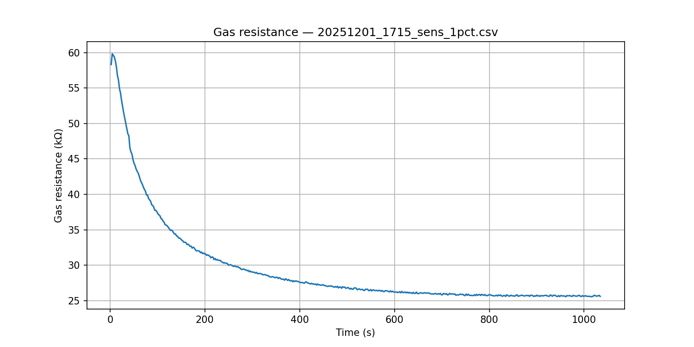
  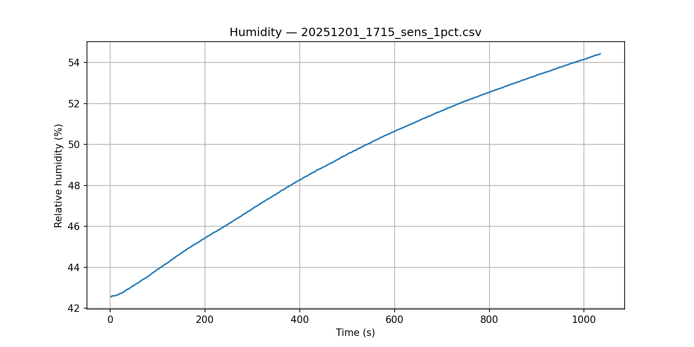
</p>

<p align="center">
  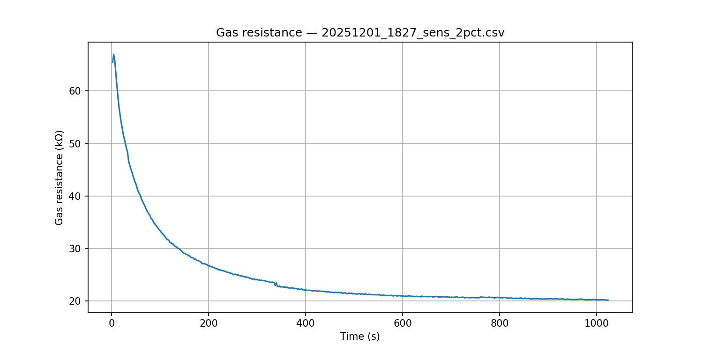
  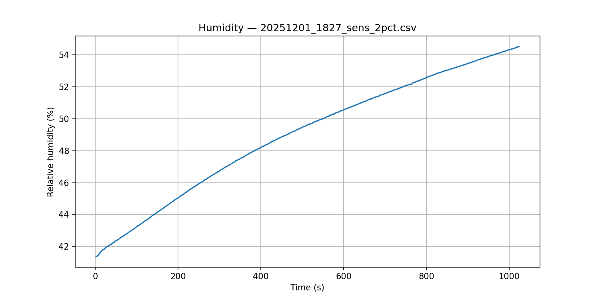
</p>

<p align="center">
  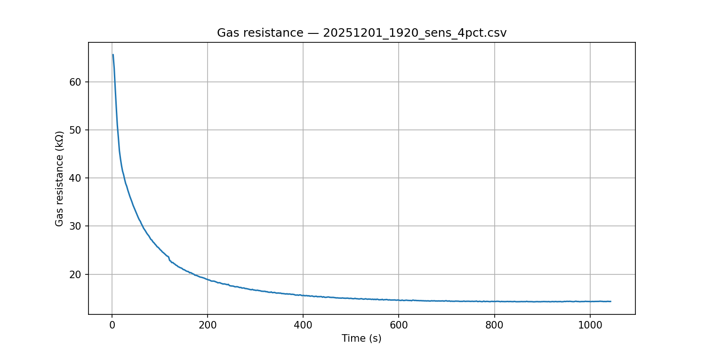
  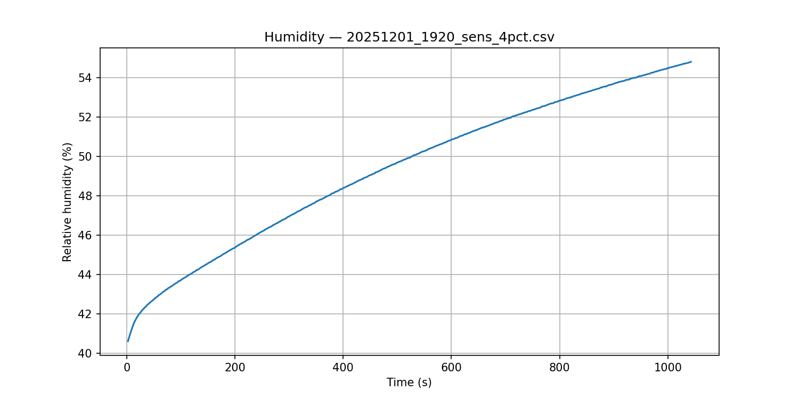
</p>

*Gas resistance and relative humidity responses of the BME688 sensor during 1 %, 2 % and 4 % ethanol measurements, showing a concentration-dependent resistance drop and a humidity increase due to evaporation from the cotton pad.*

For each ethanol concentration level (1 %, 2 % and 4 %), the **steady-state mean gas resistance R** was automatically extracted from the stable tail region of the time series by the analysis script and stored in `stats_summary.csv` for further processing in `sensitivity_linearity.py`.

The resulting mean values were:

- **1 % ethanol:** R = 25.81 kΩ  
- **2 % ethanol:** R = 20.56 kΩ  
- **4 % ethanol:** R = 14.38 kΩ

---

#### 5.3.1 Sensitivity

To determine the sensitivity, the mean gas resistance was plotted as a function of ethanol concentration and a linear model was fitted:

R(C) = a · C + b

where C is the ethanol concentration in vol-% and R is the gas resistance in kΩ.


*Sensitivity of the BME688 sensor to ethanol. The fitted linear model is R(C) = -3.71 · C + 28.90.*

From the fitted model, the sensitivity of the sensor is:

S = |a| = 3.71 kΩ/%  

This means that the gas resistance decreases by approximately **3.71 kΩ for each 1 % increase in ethanol concentration**.

The negative slope confirms the expected behaviour of the MOX gas sensor: an increase in ethanol concentration leads to a decrease in gas resistance.

---

#### 5.3.2 Linearity based on residuals

Linearity of the sensor response was evaluated using the **residuals between the measured resistance values and the fitted linear model**:

eᵢ = R_meas,i − R_fit,i

The obtained residuals for the tested ethanol concentrations were:

- **1 %:** e = +0.62 kΩ  
- **2 %:** e = −0.93 kΩ  
- **4 %:** e = +0.31 kΩ  

The standard deviation of the residuals was:

σₑ = 0.816 kΩ

The standard deviation σₑ describes the **typical spread of the measured points around the ideal linear model**.

The residual plot is shown below:

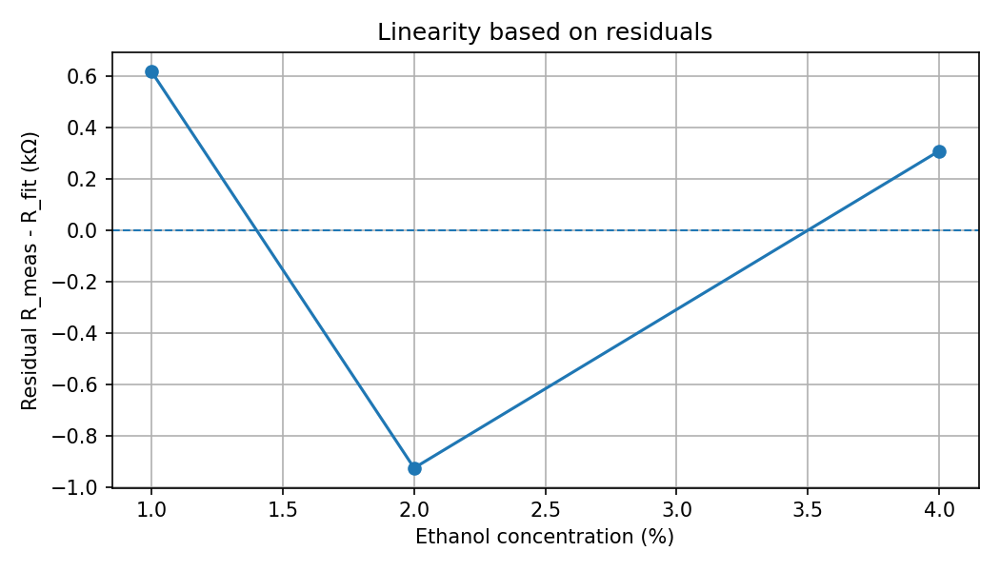

*Residuals between the measured gas resistance values and the fitted linear model.*

The standard deviation of the residuals was σₑ = 0.816 kΩ,  
while the full resistance change in the tested range was R_max − R_min = 11.43 kΩ.  
This corresponds to a relative linearity error of approximately **7.1%** of the full measurement range.  
Such a value indicates a good practical linearity of the sensor response.

---

### 5.4 Repeatability (1 % ethanol)

Repeatability of the gas sensor was evaluated at a fixed ethanol concentration of **1 vol-%** under unchanged experimental conditions.
A single long measurement was performed, and the **steady-state tail region** of the signal was used for statistical analysis.

The statistical distribution of the steady-state gas resistance values is shown in the repeatability plot below.
The plot also includes the **mean value of the tail region**, which is used as the reference level for the repeatability analysis.
The corresponding numerical statistics were calculated from this data.

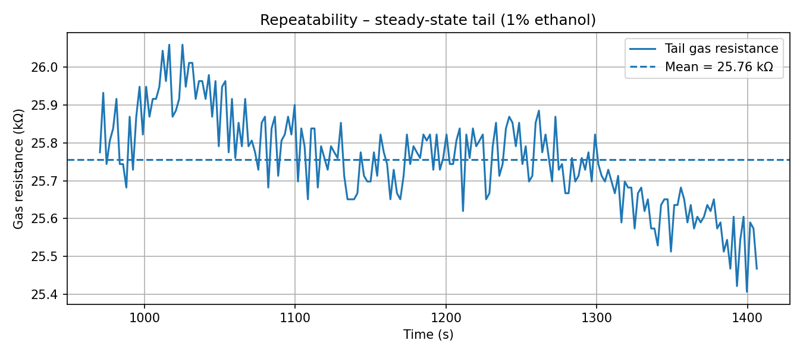

*Repeatability of the gas sensor at 1 vol-% ethanol evaluated from 200 steady-state samples. The horizontal line indicates the mean gas resistance value of the tail region.*

Repeatability was quantified using the **sample standard deviation s** and the **expanded uncertainty U with coverage factor k = 2**:

U = 2s

The obtained repeatability results were:

- **Mean gas resistance:**  
  R̄ = 25.756 kΩ

- **Standard deviation:**  
  s = 0.122 kΩ

- **Expanded uncertainty (k = 2):**  
  U = 0.244 kΩ

Using a coverage factor k = 2, the repeatability corresponds to an **approximately 95% confidence interval**.
The relative repeatability with respect to the mean resistance value is:

(0.244 / 25.756) × 100% ≈ 0.95%

This means that under unchanged conditions the sensor readings vary by about **±0.24 kΩ with 95% confidence**, corresponding to a **repeatability of approximately 1%** at 1 vol-% ethanol.

During the measurement, a slow increase in humidity and a small temperature drift were observed due to evaporation inside the chamber.
These changes may have slightly affected the signal, so the reported repeatability can be considered a **conservative estimate**.

The test was performed with minimal intervention (same setup, same cotton pad, same 1% ethanol), which makes it a valid repeatability measurement; restarting the test with new material would already shift it towards reproducibility.

---

### 5.5 Reproducibility (temperature-dependent variation)

Reproducibility describes how consistently a sensor measures the same quantity when the **external conditions are changed**.
In this project the reproducibility of the BME688 gas-sensing output was evaluated by measuring a fixed ethanol concentration of **1 vol-%** at **different ambient temperatures**.

According to the BME688 datasheet, no reproducibility specification is provided for the gas resistance channel. The only related parameter is the ‘sensor-to-sensor deviation’ of **±15 % (IAQ)**, which refers to variations between independent sensor units. Therefore, in this project reproducibility is evaluated only across different ambient conditions using a single device.

To quantify reproducibility, three measurements were performed at:

- **9 °C** (cold outdoor environment)  
- **25 °C** (room temperature)  
- **45 °C** (heated enclosure)

Before each reproducibility measurement, the sensor was allowed to stabilise at the new ambient temperature (baseline settling). Only after the gas resistance reached a steady value was the 1 % ethanol applied.

In all cases, the same measurement procedure was used, including a new cotton pad and a fresh 1 % ethanol drop, so procedural factors do not affect the results. Therefore, any differences in sensor output between the three measurements reflect only external conditions — primarily temperature.

---

### 5.5.1 Dynamic sensor response at different temperatures

The figure below shows the full time-series gas resistance for the three temperature conditions.

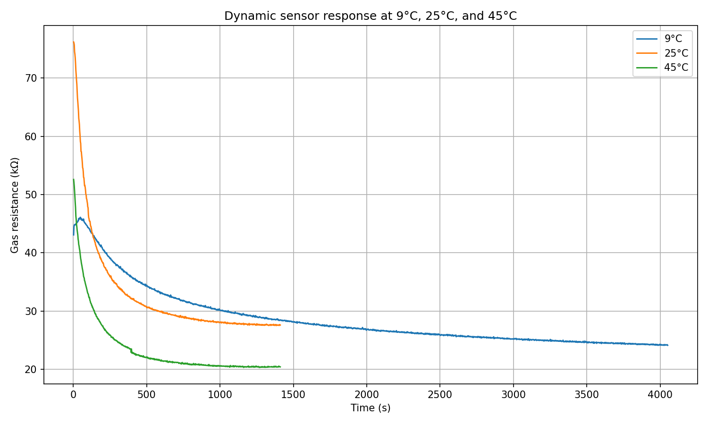

*Dynamic response of the sensor at 9 °C, 25 °C and 45 °C when exposed to 1 vol-% ethanol.*

Several effects are visible:

- At **low temperature (9 °C)**, the resistance decreases very slowly and does not stabilise fully even after ~40 minutes.  
  This is consistent with reduced ethanol vapour pressure at low temperature.
- At **room temperature (25 °C)**, the sensor reaches a stable plateau within a few minutes.
- At **elevated temperature (45 °C)**, the resistance decreases *faster* and the final steady state is significantly lower.  
  This is caused by higher ethanol evaporation rate and lower air humidity.

These results confirm that the gas resistance of the BME688 in forced-mode depends strongly on environmental temperature.

---

### 5.5.2 Steady-state analysis and reproducibility (k = 2)

For each measurement, the **last 200 samples** of the stable region were extracted using the analysis pipeline.  
The mean steady-state gas resistance values were:

| Temperature | Mean $R_gas (kΩ) |
|-------------|------------------|
| **9 °C**    | 22.30 kΩ |
| **25 °C**   | 27.79 kΩ |
| **45 °C**   | 20.48 kΩ |

Using these values, reproducibility across the three conditions was calculated as:

- **sample standard deviation:**  
  s = 3.81 kΩ

- **expanded uncertainty (k = 2):**  
  U = 2s = 7.61 kΩ

This corresponds to a **relative reproducibility** of:

(7.61 / 23.5) × 100% ≈ 32%

(where 23.5 kΩ is the mean of the three measurements).

This result shows that the sensor output for the same ethanol concentration varies by **±3.81 kΩ (1σ)** or **±7.61 kΩ (k = 2)** over the 9–45 °C range.

---

### 5.5.3 Temperature sensitivity of the gas-sensor resistance

A linear regression was applied to the three steady-state resistance values:

R(T) = aT + b

The fitted slope was:

dR/dT = -0.060 kΩ/°C

This negative slope indicates a **general downward trend** of the gas resistance over the 9–45 °C temperature range.
However, the actual behaviour is **not monotonic**: the resistance increases from 9 °C to 25 °C and then decreases at 45 °C.
Therefore, the fitted slope should be interpreted only as an **overall trend across the whole range**, not as a physical “per-degree decrease” of the gas resistance.

The reproducibility summary plot is shown below.

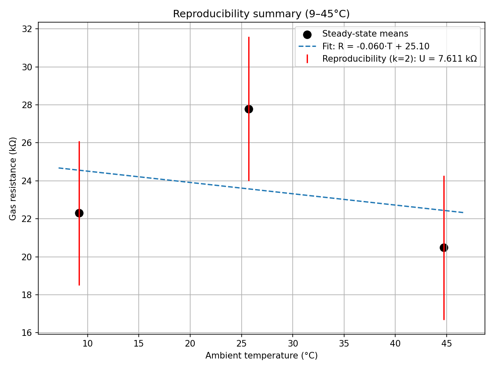

*Steady-state reproducibility of the BME688 sensor at 9 °C, 25 °C and 45 °C. Error bars represent ±U/2 for k = 2.*

---

### 5.5.4 External factors affecting reproducibility

In addition to temperature, several other external factors influence sensor reproducibility:

- **Humidity:** At low temperatures, humidity increased inside the chamber and slowed ethanol evaporation, reducing the sensor response.  
- **Ethanol vapour pressure:** Ethanol concentration above the cotton pad depends strongly on temperature; at 9 °C vapour pressure is very low, causing incomplete stabilisation.
- **Chamber materials and airflow:** Slight differences in diffusion conditions (cold outdoor air vs warm indoor air) affect the equilibration time.
- **Heater interaction:** At 45 °C ambient, the sensor's internal heater operates relative to a hotter baseline, changing its effective temperature.

These effects make reproducibility inherently worse than repeatability.

---

### 5.5.5 Summary of reproducibility over 9–45 °C

The reproducibility of the BME688 under changing temperature conditions was found to be:

- **Expanded uncertainty (k = 2):**  
  U = 7.61 kΩ

- **Relative reproducibility:**  
  ≈ 32%

- **Main limiting factor:** temperature-dependent ethanol vapour pressure and raw MOX resistance drift

The sensor shows **high repeatability**, but **poor reproducibility** when external conditions vary, which matches the expectations from the BME688 datasheet.

This demonstrates that the BME688, when used without Bosch's BSEC compensation algorithms, requires **strict environmental control** for quantitative measurements.

## 6. Conclusion

In this project, the Bosch BME688 gas sensor was characterised in terms of **sensitivity**, **linearity**, **repeatability**, and **reproducibility** using a custom 3D‑printed measurement chamber and an ESP32‑C6 data‑logging setup.

The main results are:

* **High sensitivity** to ethanol vapour in the 1–4 % range.
* **Good linearity**, with residuals corresponding to about **7 %** of the full measurement range.
* **High repeatability** under identical conditions, with an expanded uncertainty of about **0.244 kΩ (≈1 %)**.
* **Low reproducibility** when ambient temperature changes, with an expanded uncertainty of about **7.61 kΩ (≈32 %)** over the 9–45 °C range, mainly due to temperature-dependent ethanol vapour pressure and MOX resistance drift.

Overall, the BME688 provides stable and reliable measurements **as long as environmental conditions remain constant**. However, the raw MOX gas‑resistance output is **strongly temperature‑dependent**, meaning that accurate quantitative measurements require either:

* strict environmental control, or
* compensation algorithms such as Bosch BSEC.

These findings match expectations from the datasheet and highlight the importance of controlled testing conditions when using MOX gas sensors for quantitative sensing tasks.
